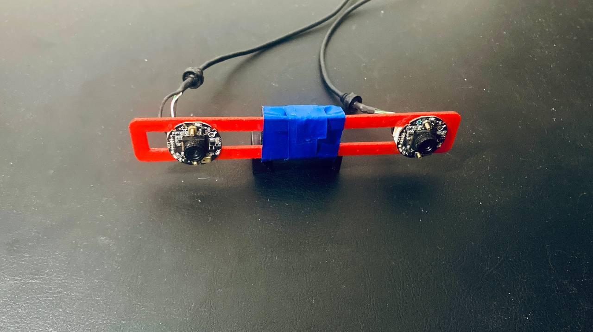

## Authors

- [Petr Kryzhanovskii](https://github.com/yourusername) - Creator and Maintainer
- [Vladislav Fakhretdinov](https://github.com/EmperorNao) - Contributor
- [Alexey Sakharov](https://github.com/AlSakharoB) - Contributor
- [Amanov Aldaiar](https://github.com/GaiusJuliusCaesar38) - Contributor
- [Aleksandr Amerikanov](https://www.hse.ru/en/staff/a.amerikanov) - Consultant

## Description

This project focuses on testing and utilizing AI models to create point clouds from stereo images. Essentially, the system takes paired images from a stereo camera, computes the disparity image using a neural network, and then generates a point cloud. /
The resulting point cloud is a part of future 

## Requirements

To run this system, you need a digital stereo camera to provide input images. The computation relies on an NVidia GPU to ensure efficient processing. Therefore, an NVidia CUDA-compatible GPU is required.

Example of stereo camera used (pair of A4tech FHD 1080p PC camera
Model: pk-910h):


The system uses NVidia CUDA for GPU-accelerated AI model computations. To optimize processing time, the TensorRT model format is employed, and the `pycuda` package is used to execute the model on the GPU.

CUDA toolkit must be installed on the device. For detailed instructions on installing CUDA drivers, please refer to the official NVidia CUDA installation guide for [Windows](https://docs.nvidia.com/cuda/cuda-installation-guide-microsoft-windows/index.html) or [Linux](https://docs.nvidia.com/cuda/cuda-installation-guide-linux/index.html).

### Additional Dependencies
- git-lfs
- Python 3.10
- Docker

### Models

For disparity estimation Hitmap model was used. Before starting the container download TensorRT model use git LFS by running:

```bash
git lfs pull
```
Downloaded models will be located in `/model_converter`.

## Launch

To build and start the Docker container run:

```bash
python3 d.py -bs
```
\
After installing packages or building the Docker container, launch the system by running the `launch.sh` script:

```bash
bash launch.sh
```

### RVIZ2

RVIZ2 is a visualization tool used primarily with ROS 2 for visualizing sensor data, robot states, and environment information in a 3D graphical interface. To launch RVIZ2 inside the container run the following commands: \
Outside the container
``` bash
xhost local:+
```

Inside the container
```
rviz2
```

## Contributing

We welcome contributions! To contribute, please follow these steps:

1. Fork the repository.
2. Create a new branch (`git checkout -b feature/AmazingFeature`).
3. Make your changes.
4. Commit your changes (`git commit -m 'Add some AmazingFeature'`).
5. Push to the branch (`git push origin feature/AmazingFeature`).
6. Open a Pull Request.

## Acknowledgments

- [TensorRT](https://developer.nvidia.com/tensorrt)
- [PyCUDA](https://documen.tician.de/pycuda/)
- [ROS](https://www.ros.org/)
- Special thanks to the open-source community and all contributors.

## Contact Information

For any questions or suggestions, feel free to contact:

- Kryzhanovskii Petr - [pkkryzh1533@gmail.com](pkkryzh1533@gmail.com)