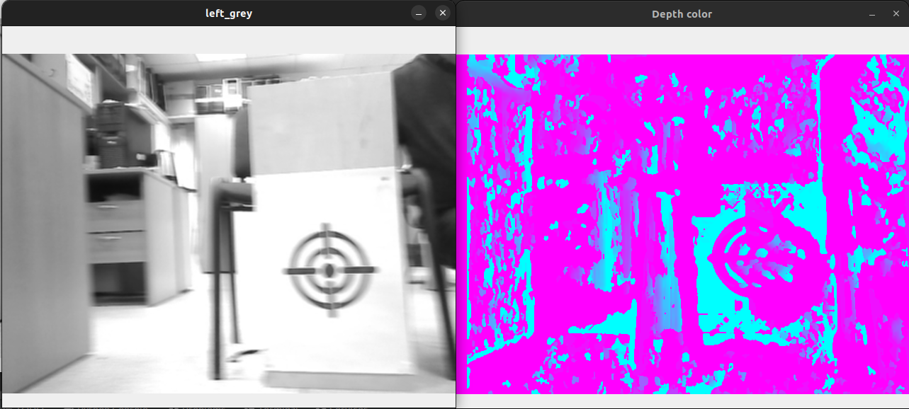
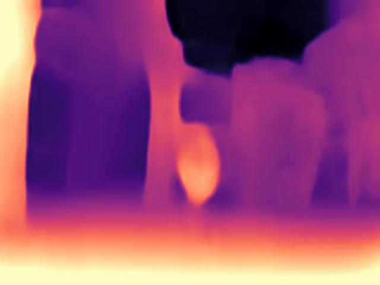
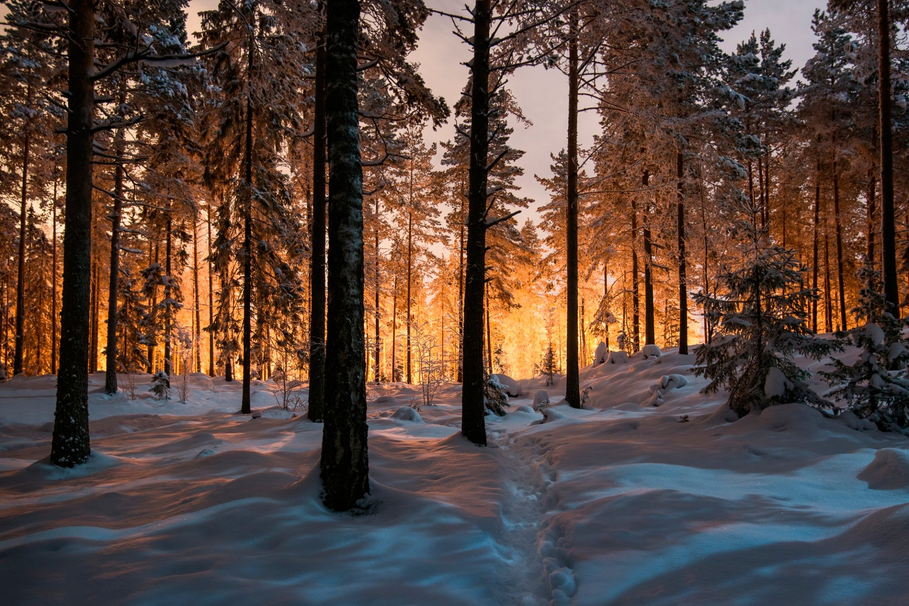
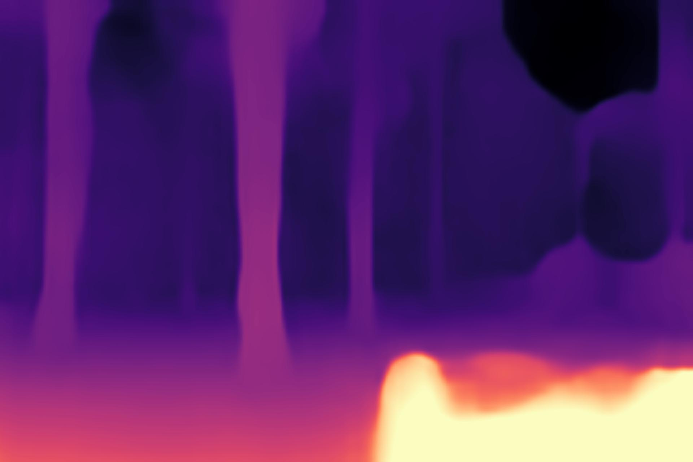
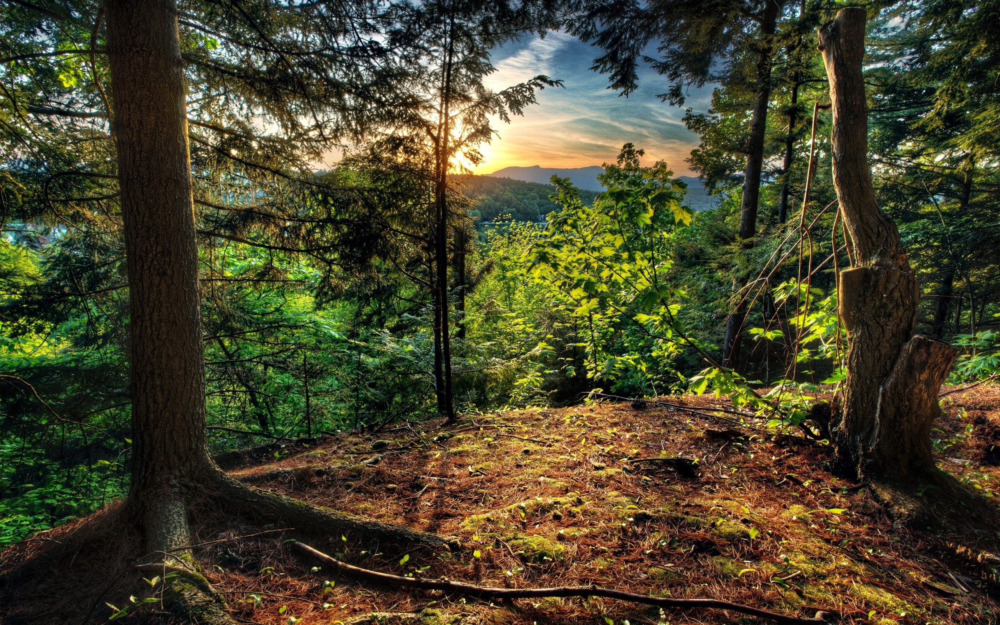
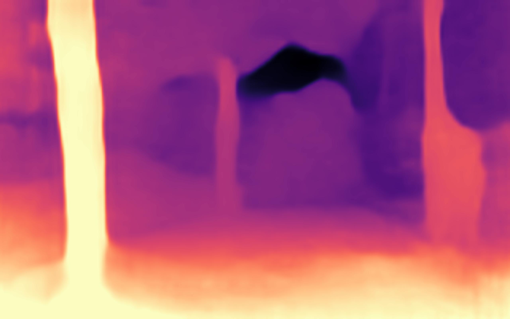

### Подбор параметров

Продолжил экспериментировать с параметрами + блюром для построения disparity/depth:

Результат получше, но всё равно непонятно как кластеризовать, чтобы корректно учитывать:

Кажется проблема, что для больших однотонных объектов рассчёт disparity будет плохим, но я не уверен.

### Эксперименты с monodepth

Пробовал смотреть на картинки + мерять перф.

Работа полного пайплайна, а именно ресайз + сетка (енкодер + depth декодер) - медленная, <10 фпс на моём ноуте.

Попробовал пожать количество операций в сетке уменьшив входы - фпс порядка 15 и кажется норм - с рассчётом что дрон может летать ~50 км/ч = 15 м/c т.е считай 1 кадр на 1 секунду - кажется ок.

Наши тестовые:

 

Попробовал потестить для разнообразия другие картинки:

### 1 
 

### 2
 

Но с сеткой всё равно какая-то проблема с глубиной - я пока не понял, как сделать чтобы она считала их.

#### Вопросы, если хотим тестить сетку

1. Нужно потестить перф на железке, но кажется если это jetson nano - то 20+ фпс думаю будет, если у меня 15 фпс на i7 цпу.
2. Нужно разобраться как посчитать реальную глубину из той которая выдала сетка
3. Померять качество, в т.ч темное время суток, яркий свет, отражения и т.д, будет ли ок. Пока визуально нравится по тем примерам что я смотрел

